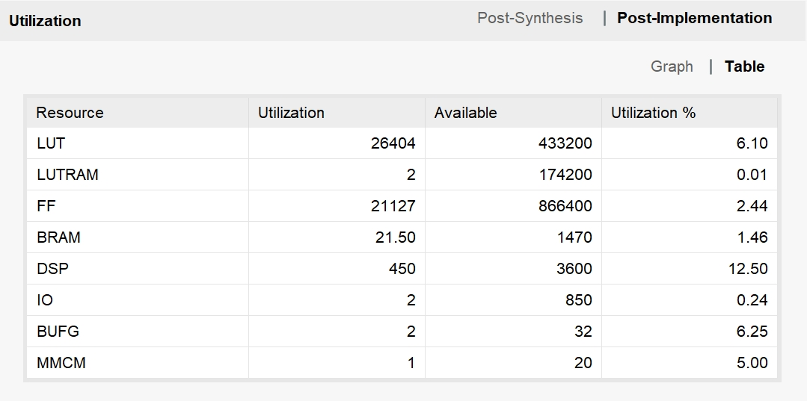

# Efficient FPGA-based Accelerator for Post-Processing in Object Detection
This repository include the source code and testing ways in the paper Efficient FPGA-based Accelerator for Post-Processing in Object Detection.
```plaintext
.
├── HW                   # Hardware-related engineering and source code
│    ├── implementation
│            ├──dnn_690t # project folder, the project file is dnn_690t.xpr (include synthesis and implementation reports)   
│    ├── simulation
│            ├──dnn_690t # project folder, the project file is dnn_690t.xpr (RTL-level simulations can be performed)
├── SW
│   ├── 
│   └── ...
│
├── DATA
│   └── 
│
└── README.md
```
## Part1:  The implementation report of our accelerator
---
Our accelerator implemented on a Xilinx Virtex-7 690t FPGA runs at 150MHz. The synthesis and implementation details can be found in project ./implementation/dnn_690t/dnn_690t.xpr. The xpr file needs to be opened with __Vivado 2018.3__. The resource utilization of our accelerator is shown in below image.


