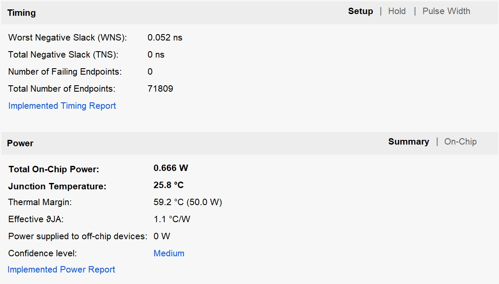
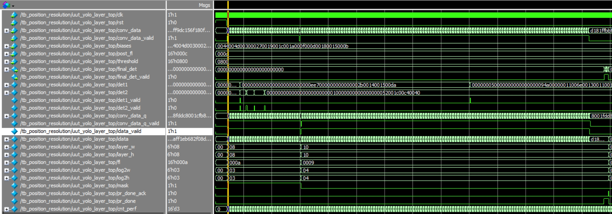
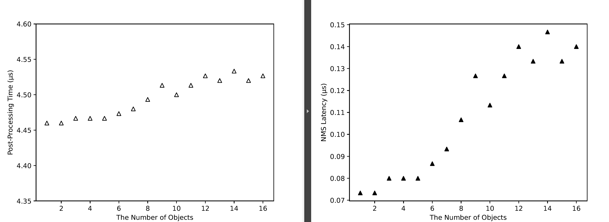

# Efficient FPGA-based Accelerator for Post-Processing in Object Detection
This repository include the source code and testing ways in the paper Efficient FPGA-based Accelerator for Post-Processing in Object Detection.
```plaintext
.
├── HW                   # Hardware-related engineering and source code
│    ├── implementation
│            ├──dnn_690t # project folder, the project file is dnn_690t.xpr (include synthesis and implementation reports)   
│    ├── simulation
│            ├──dnn_690t # project folder, the project file is dnn_690t.xpr (RTL-level simulations can be performed)
├── SW
│   ├── 
│
├── DATA
│   ├──  input          # Path of input file. These results come from the output of the CNN part in YOLOv3Tiny.
│   ├──  output         # Path to save FPGA simulation results
│   └──  groundtruth    # Actual post-processing results.
│
└── README.md
```
## Part1:  The implementation report of our accelerator
---
Our accelerator implemented on a Xilinx Virtex-7 690t FPGA runs at 150MHz. The synthesis and implementation details can be found in project ./implementation/dnn_690t/dnn_690t.xpr. The xpr file needs to be opened with __Vivado 2018.3__. The resource utilization and power report of our accelerator is shown in below image.



## Part2:  The performance of our accelerator
---
The First step, a joint simulation environment of __Vivado 2018.3 and Modelsim 10.6d__ is required to evaluate the accelerator performance. The simulation environment setup can be found at https://docs.xilinx.com/r/en-US/ug900-vivado-logic-simulation/Simulating-with-Third-Party-Simulators.

The second step, Open . /simulation/dnn_690t/a.xpr project, find the testbench file sim2/tb_position_resolution.v, and change the file paths in the code on lines 73 to 75.

The third step, start the simulation by adding the yolo_layer_top module to the wave window to see the results and performance. The result signal is final_det and the result valid signal is final_det_vaild. counter cnt_perf records the number of clocks used for processing.The simulation waveform is shown below. 


The fourth step, the number of clock cycles for the full processing flow is recorded and the processing time is calculated based on the running frequency. The performance of the NMS module can be obtained in the same way. Processing time is calculated as time = (final-start)*(1/150), where final is the clock cycle count of the last result and start is the clock cycle count of the first valid input data. The table below and the figure below show the results for some of the data tested with the data names in ./HW/simulation/list.txt.
| bbox number | clock cycles | Processing time(μs) | NMS time(μs) |
|------|------|------|------|
|1	|669	|4.46 	|0.07 |
|2	|669	|4.46 	|0.07 |
|3	|670	|4.47 	|0.08 |
|4	|670	|4.47 	|0.08 |
|5	|670	|4.47 	|0.08 |
|6	|671	|4.47 	|0.09 |
|7	|672	|4.48 	|0.09 |
|8	|674	|4.49 	|0.11 |
|9	|677	|4.51 	|0.13 |
|10	|675	|4.50 	|0.11 |
|11	|677	|4.51 	|0.13 |
|12	|679	|4.53 	|0.14 |
|13	|678	|4.52 	|0.13 |
|14	|680	|4.53 	|0.15 |
|15	|678	|4.52 	|0.13 |
|16	|679	|4.53 	|0.14 |
|20	|734	|4.89 	|0.51 |
|27	|694	|4.63 	|0.24 |
|33	|863	|5.75 	|1.37 |
|37	|695	|4.63 	|0.25 |

